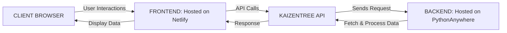

# Kaizntree

Kaizntree is an intuitive and secure inventory management platform that streamlines item tracking and management. It provides a user-friendly dashboard for monitoring SKU, product names, categories, tags, stock status, and available stock levels, enhanced with advanced filtering options for precise data retrieval. The application ensures data integrity through robust authentication, and offers real-time inventory insights.

## Live Application

Experience the live application [here](https://kaizntree.netlify.app/).

### Demo Credentials

To get a feel for the application, you can log in using the following demo credentials:

- **Username:** `user1`
- **Password:** `user1`

Alternatively, feel free to sign up for a new account and explore the dashboard with your own unique login.
 
## Technology Stack

### Frontend

- **React:** The frontend interface is built with the React framework, utilizing modern JavaScript features for a responsive and dynamic user experience. It's hosted on [Netifly](https://www.netlify.com/), which offers a global CDN and high performance, ensuring quick load times and a smooth experience for users worldwide.

### Backend

- **Django:** Our backend is powered by the Django framework, acclaimed for its robustness and ability to scale with Python. With Django, we have a structured, secure, and powerful backend system. Hosting on [PythonAnywhere](https://www.pythonanywhere.com/) provides a hassle-free deployment and hosting service, making it a perfect fit for Python-based web applications.

### Database

- **SQLite3:** As the default database for Django, SQLite3 is used for its simplicity and efficiency in development and testing phases. It requires zero configuration and is an excellent choice for applications that do not demand the scalability provided by larger database systems like PostgreSQL or MySQL. For production, it's recommended to switch to a more robust database system to handle a higher volume of data transactions and provide advanced features such as concurrency control and full-text search.

## How it works?



## API Documentation

API Documentation done using Postman. You can find the Kaizntree API Documentation [here](https://documenter.getpostman.com/view/16414670/2sA2r3b6WY).

## Getting Started

These instructions will get you a copy of the project up and running on your local machine for development and testing purposes.

### Prerequisites

- Python (3.x recommended)
- Django
- React
- Node.js and npm

### Setting Up the Environment

1. **Clone the repository**

    ```bash
    git clone https://github.com/freakbeast14/Kaizntree.git
    cd Kaizntree
    ```
2. **Set up a virtual environment**

    ```bash
    python -m venv venv
    ```
    - Activate the virtual environment:
      - On Windows:
        
          ```
          venv\Scripts\activate
          ```
      - On macOS and Linux:
        
          ```
          source venv/bin/activate
          ```
3. **Install backend dependencies**

      ```
      pip install -r requirements.txt
      ```
4. **Set up environment variables**

   Create a _.env_ file in the root of the Django project and add the following:

      ```
      SECRET_KEY=your_django_secret_key
      DEBUG=True # Set to False in production
      ```
   Make sure to replace _your_django_secret_key_ with your actual Django secret key.
6. **Install frontend dependencies**

   Navigate to the React app directory (assuming it's named frontend):
      ```
      cd kaizntree_frontend
      npm install
      ```

## Running the Application

1. **Start the Django backend server**

   Navigate back to the Django project root directory and run:
   
      ```
      python manage.py runserver
      ```
  If you are facing any issues with migration, run the following commands before running the server:
  
      ```
      python manage.py makemigrations
      python manage.py migrate
      ```
2. **Start the React frontend**

   In a new terminal, navigate to the React app directory and start the React development server:
   
      ```
      npm start
      ```
   This should launch your default web browser and navigate to http://localhost:3000, where you can interact with the application.

## Running Unit Tests for API endpoints

Navigate back to the Django project root directory and run unit tests for the API endpoints using the following command:

```
python manage.py test
```
